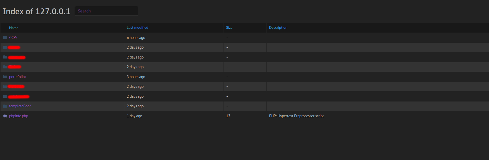
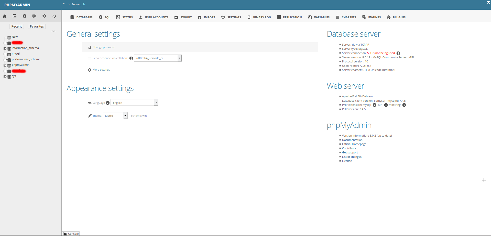
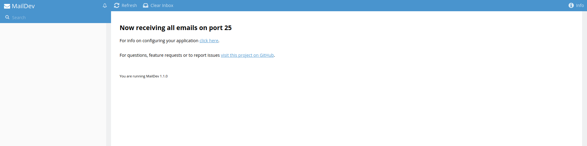
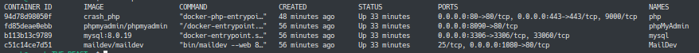

# DOCKER ENV FOR WEB DEVELOPER


The easiest way for local web dev environnement

----------------------
Include :

- PHP 7.4.5 

- symfony v4.14.3

- Composer

- Apache 2.4.38 server

- Fancy-Index from https://github.com/Vestride/fancy-index

- Mysql server 8.0.19

- PhpMyAdmin 5.0.2

- MailDev 1.1.0

-----------
## Gallery
View of fancy index (color depend of ur system)



View of PhpMyAdmin (default theme, but activated only after login & reload page)



View of maildev



View of docker




-----------
## How to start

### Two way :

Run ./install.sh

```bash
    ./install.sh mode
```

Mode available :

- cron (Add cron for launch container always on startup)
- alias (No cron but alias created to launch all docker)


OR

- Use ./docker_start.sh and ./docker_stop.sh (or docker-compose up -d & down in this folder)

-----------

# Data

Mysql data stored into mysql folder (persitant)

Php folder used like /var/www/html folder (persitant)

Store all your websites into php folder

-----------

## Route

Local --> http://127.0.0.1

Local with TLS --> https://127.0.0.1 (accepte risk for autosigned certificat)

PhpMyAdmin --> http://127.0.0.1:8090/

MailDev --> http://127.0.0.1:1080

-----------

## Configuration

### PhpMyAdmin / Mysql logs : 
```
    Username : Root

    Password : Root
```

### Database Host
```
    db
```

### Exemple DB conf php
```php
return [
	"db_user" => "root",
	"db_password" => "root",
	"db_host" => "db",
	"db_name" => "db_test"
];
```

-----------


PR & issues open !

Enjoy :D
