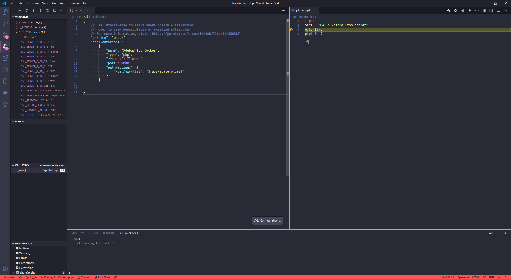
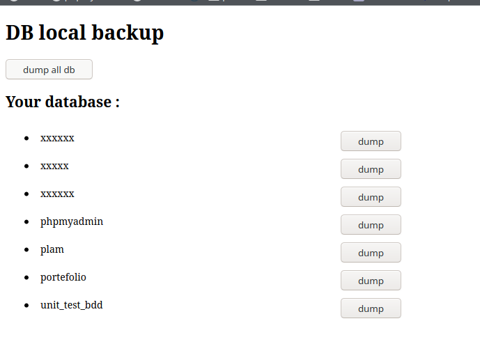
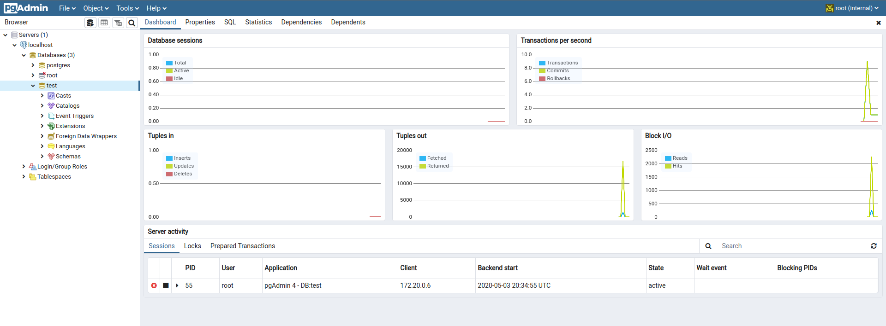

# DOCKER ENV FOR WEB DEVELOPER


The easiest way for local web dev environnement

----------------------

Compatibilities : 
 - Linux ✔️
 - Windows ✔️

Master branch have this two compatibilities <br>
If you want just windows, download the windows latest version in [release](https://github.com/Crash-Zeus/webdeveloper-docker-env/releases) <br>
Same if you want just linux version

## Requirements :

- docker
- docker-compose

----------------------
----------------------

Include in this package :

- PHP 7.4.5 with Xdebug v2.9.4

- symfony 4.14.3

- Composer

- Apache server 2.4.38

- Fancy-Index from https://github.com/Vestride/fancy-index

- Mysql server 8.0.19

- PostgreSQL 12.2

- PgAdmin 4

- PhpMyAdmin 5.0.2

- MailDev 1.1.0

- Db backup tool for backup your local database

-----------
## Gallery
View of fancy index (color depend of ur system)


View of PhpMyAdmin (default theme, but activated only after login & reload page)


View of maildev


View of docker


View of xdebug working



View of the simple db backup tool for mysql



View of the simple PgAdmin




-----------
## How to start

### Two way :

#### - Linux

Run ./install.sh

```bash
    ./install.sh mode
```

Mode available :

- cron (Add cron for launch container always on startup)
- alias (No cron but alias created to launch all docker)

Alias :
```
alias westart='/your/path/to/docker_start.sh'
alias westop='/your/path/to/docker_stop.sh'
```

OR

- Use ./docker_start.sh and ./docker_stop.sh (or docker-compose up -d & down in this folder)


#### - Windows

Run install.bat as administrator

Usage :

westart => up all container <br>
westop => down all container

Make sur docker desktop is up and running when you run cmd

-----------

# Data

Mysql data stored into mysql folder (persitant)

Php folder used like /var/www/html folder (persitant)

Store all your websites into php folder

You can modify all conf from conf folder (not persistant, need build to effect)

Logs for apache & php available in logs folder (persistant)

Db backup path : php/db_backup/dump (mysql only)

Postgre data store in postgre folder (persistant)

Persistant conf for pgadmin in pgadmin folder

-----------

## Route

Local --> http://127.0.0.1

Local with TLS --> https://127.0.0.1 (accepte risk for autosigned certificat)

PhpMyAdmin (mysql only) --> http://127.0.0.1:8090/

PgAdmin (for postgre) -> http://127.0.0.1:8100/

MailDev --> http://127.0.0.1:1080

-----------

## Configuration

### PhpMyAdmin & Mysql: 
```
    Username : root

    Password : root
```

### PgAdmin conf:
```
    Host : postgres
    Port : 5432
    Maintenance db : postgres
    Username : root
    Password : root
```
(if an error appared on container pgadmin, run `sudo chown -R 5050:5050 pgadmin`)
### Database Host
Mysql host
```
    db
```
Postgres host
```
    postgres
```

### Exemple DB conf php
```php
// With mysql
return [
	"db_user" => "root",
	"db_password" => "root",
	"db_host" => "db",
	"db_name" => "db_test"
];
// Or with postgre
return [
	"db_user" => "root",
	"db_password" => "root",
	"db_host" => "postgres",
	"db_name" => "db_test"
];
```

### Config X-Debug with vscode
Replace `your_folder` with the name of folder you want to debug

```json
{
    "version": "0.2.0",
    "configurations": [
        {
            "name": "Xdebug",
            "type": "php",
            "request": "launch",
            "port": 9000,
            "pathMappings": {
                "/var/www/html/your_folder/": "${workspaceFolder}"
            }
        }

    ]
}
```

-----------


PR & issues open !

Enjoy :D
